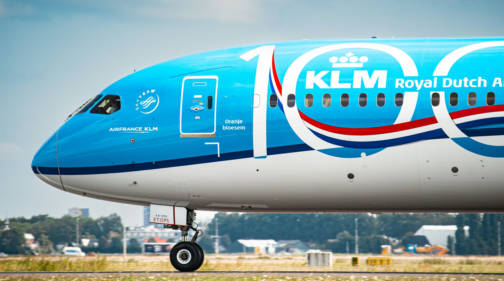

---

<h1 align="center">Hi, I'm nyx</h1>
<h3 align="center">13-year-old full-stack developer, aviation enthusiast, and aspiring KLM pilot from the Netherlands.</h3>

---

## About Me

I'm a self-taught developer with a strong interest in full-stack development, Linux, self-hosting, and aviation. I enjoy building practical projects, experimenting with new technologies, and combining software with real-world interests.

## Interests

- Full-stack Development
- Linux & Self-Hosting
- Aviation & Flight Simulation
- Home Cockpit Development
- Space Exploration
- 3D Printing
- Open Source

## Current Projects

- Server Dashboard
- Aviation-related web applications
- Self-hosted services and infrastructure
- A320 home cockpit
